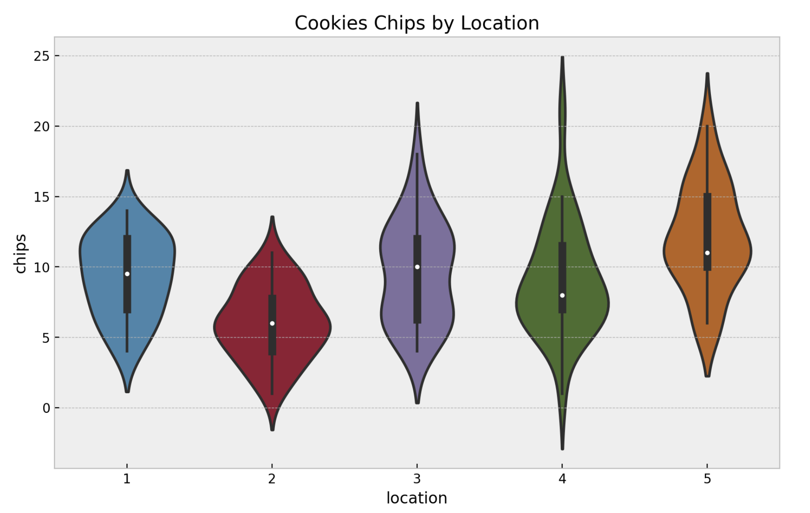
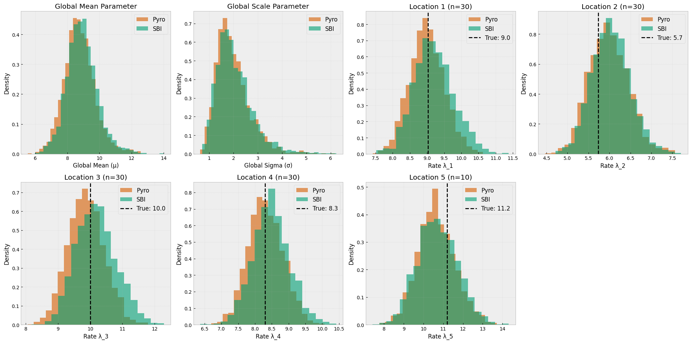

# Pyro Meets SBI: Unlocking Hierarchical Bayesian Inference for Complex Simulators

### Bridging probabilistic programming and simulation-based inference

<br>

[EuroScipy 2025](https://euroscipy.org/), Kraków, Poland

### [Jan Teusen](https://janfb.github.io/) (né Boelts)

Slides available at [EuroSciPy website](https://github.com/janfb/pyro-meets-sbi)

---

## About Me

- Maintainer of the [`sbi` package](https://sbi.readthedocs.io/en/latest/)

**Background**

- PhD in Machine Learning and Neuroscience in Tübingen, Germany
- Focus on "AI for Science"

**Current Role**

- Researcher @ [TransferLab, appliedAI Institute for Europe](https://transferlab.ai/about/)
- OSS, AI research, AI education

---

## A Journey Through Many Concepts

<span class="highlight-hierarchical">Hierarchical</span>
<span class="highlight-simulation">Simulation-Based</span>
<span class="highlight-bayesian">Bayesian Inference</span>
with <span class="highlight-pyro">Pyro</span>

We'll build these concepts step by step using a simple example

---

## Our Example: The Cookie Factory Problem 🍪

**The Scenario:**

- Cookie factory with 5 locations producing chocolate chip cookies
- Same global recipe, but each location might vary
- Data: Number of chocolate chips in 30 cookies for each location

**The Goal:**

- Understand the differences between locations
- Estimate typical chip count per location

**The Challenge:**

- local and global patterns, limited data

---

## The Data

<div class="columns">
<div>

```python
# Observed data: raw chip counts
location: [1, 1, 1, ..., 5, 5, 5]
chips:    [12, 12, 6, ..., 20, 11, 14]
```

**Observations:**

- Different means across locations
- 150 total observations
- 30 cookies per location

**Key insight:**
There might be a global and a local recipe

</div>
<div>



*Chocolate chips across 5 factory locations*

</div>
</div>

---

## How Do We Model This?

**Step 1: Choose a Probabilistic Model**

- **Likelihood**: How data is generated given parameters
  - `chips ~ Poisson(rate)`
- **Prior**: Our beliefs before seeing data
  - `rate ~ Gamma(α, β)`

**Why probabilistic?**

- Captures uncertainty naturally
- Principled way to combine prior knowledge with data
- Enables hierarchical inference

---

## The Goal: <span class="highlight-bayesian">Bayesian Inference</span>

**What we want:** Estimate rate λ for each location

**Maximum Likelihood Estimate** (point estimate)

```python
λ_ML = argmax P(data|λ)  # Single number
# Location 1: λ = 9.3
```

**Bayesian Inference** (full distribution)

```python
P(λ|data) ∝ P(data|λ) × P(λ)  # Distribution
# Location 1: λ ~ Gamma(9.3, 0.5 | data)
```

**The Power**: Uncertainty quantification!
- "I'm 95% confident λ is between 8.3 and 10.3"

---

## Probabilistic Programming with <span class="highlight-pyro">Pyro</span>

**How do we implement these models efficiently?**

Probabilistic Programming Languages (PPLs) let us write models as code:


```python
def cookie_model(chips=None):
    # Prior
    lam = pyro.sample("lam", dist.Gamma(2, 0.2))
    # Likelihood
    pyro.sample("obs", dist.Poisson(lam), obs=chips)

nuts_kernel = NUTS(cookie_model)
mcmc = MCMC(nuts_kernel)
```

<div class="columns">

- direct access to MCMC or VI algos
- `pyro.plate` exploits conditional independence

<div>

- Easy switch between different models
- Also available: PyMC, Stan, NumPyro

</div>
</div>

---

## Approach 1: Pooled Model

**Assumption**: All locations have the same rate

```python
def pooled_model(locations, chips=None):
    # One rate for all locations
    lam = pyro.sample("lam", dist.Gamma(2, 0.2))

    # Likelihood
    with pyro.plate("data", len(locations)):
        pyro.sample("obs", dist.Poisson(lam), obs=chips)
```

$$\text{chips} \sim \text{Poisson}(\lambda)$$
$$\lambda \sim \text{Gamma}(2, 0.2)$$

**Problem**: Ignores location differences!

---

## Approach 2: Unpooled Model

**Assumption**: Each location is completely independent

```python
def unpooled_model(locations, chips=None):
    n_locations = 5
    with pyro.plate("location", n_locations):
        # Independent rate per location
        lam = pyro.sample("lam", dist.Gamma(2, 0.2))

    # Likelihood
    rate = lam[locations]
    with pyro.plate("data", len(locations)):
        pyro.sample("obs", dist.Poisson(rate), obs=chips)
```

$$\text{chips}_\ell \sim \text{Poisson}(\lambda_\ell)$$
$$\lambda_\ell \sim \text{Gamma}(2, 0.2) \quad \forall \ell$$

**Problem**: No information sharing between locations!

---

## Approach 3: <span class="highlight-hierarchical">Hierarchical Model</span> ✨

**Key Insight**: Locations are different but related

```python
def hierarchical_model(locations, chips=None):
    # Hyperpriors - global parameters
    mu = pyro.sample("mu", dist.Gamma(2, 0.2))
    sigma = pyro.sample("sigma", dist.Exponential(1))

    # Location-specific rates (drawn from shared distribution)
    with pyro.plate("location", len(locations)):
        lam = pyro.sample("lam", dist.Gamma(mu**2/sigma**2, mu/sigma**2))

    # Likelihood
    with pyro.plate("data", len(locations)):
        pyro.sample("obs", dist.Poisson(lam[locations]), obs=chips)
```

**Benefits**: Partial pooling, shrinkage, better predictions!

---

## The Power of <span class="highlight-hierarchical">Hierarchical Models</span>

**Shrinkage Effect**

```
Unpooled:     [9.3, 6.0, 9.6, 8.9, 12.0]
               ↓    ↓    ↓    ↓     ↓
Hierarchical: [9.2, 6.5, 9.5, 9.0, 11.5]

Global mean: ———————— 9.15 ————————
```

Extreme estimates pulled toward global mean

**Why this matters:**

<div class="columns">

- More robust estimates, less overfitting
- Borrow strength across groups

<div>

- Balance of pooling and independence
- Predict new locations with fewer data

</div>
</div>

---

## But What If... 🤔

**Your model is a complex simulator!**

```python
def complex_simulator(params):
    # Drift-diffusion model for decision making
    # Neural network simulation
    # Climate model
    # Agent-based economic model
    # ... 1000s of lines of code ...
    return simulated_data

# Problem: No analytical likelihood!
# P(data|params) = ???
```

**Traditional PPLs**: 😢 "I need an explicit likelihood formula!"

**This is where most science happens!**

---

## Enter: <span class="highlight-simulation">Simulation-Based Inference (SBI)</span>

<div class="columns">
<div style="width: 45%;">

**The Problem:**
- Complex simulators
- No analytical likelihood
- P(data|params) = ???

**The SBI Solution:**

Neural Likelihood Estiamtion (NLE):

1. Simulate (params, data) pairs
2. Train neural network
3. Use learned likelihood

</div>
<div style="width: 53%;">

```python
# Traditional: Need formula
def likelihood(data, params):
    # tractable statistical models
    return model(data, params)

# SBI: Only simulations!
def simulator(params):
    # Complex simulation
    return data

# Simulate
θ = sample_prior()
x = simulator(θ)

# Learn likelihood: normalizing flows
neural_likelihood = train(dataset)
```

</div>
</div>

<!-- ---

## Three Flavors of Neural <span class="highlight-simulation">Simulation-Based Inference </span>

<br>

| Method | What it learns | Best for | Key advantage |
|--------|---------------|----------|---------------|
| **NPE** | `p(θ\|x)` | Fast amortized inference | Instant posteriors |
| **NLE** | `p(x\|θ)` | MCMC sampling | Synthetic data |
| **NRE** | `p(θ,x)/p(θ)p(x)` | MCMC sampling | Embeddings |

<br>

**We focus on NLE,** as it learns the single-trial likelihood. -->

---

## The Magic: Wrapping NLE in <span class="highlight-pyro">Pyro</span> 🎯

<div class="columns">
<div>

**Step 1: Train NLE**

```python
# Generate training data
theta = prior.sample((1000,))
x = simulator(theta)

# Train neural likelihood
from sbi.inference import NLE
nle = NLE().append_simulations(theta, x)
estimator = nle.train()
```

</div>
<div>

**Step 2: Use in Pyro**

```python
def sbi_pyro_model(x_o=None):
    # Prior
    theta = pyro.sample("theta", prior)

    # Use neural likelihood
    with pyro.plate("trials", n):
        dist = SBItoPyro(estimator, theta,)
        x = pyro.sample("x", dist, obs=x_o)
```

</div>
</div>

<br>

- We wrap `sbi` NLE object into a `pyro` distribution
- `SBItoPyro` wrapper: Class with 150 lines, mostly shape handling for `pyro`

---

## Comparison: Standard Pyro vs <span class="highlight-simulation">SBI</span>-<span class="highlight-pyro">Pyro</span>

<div class="columns">
<div>

**Standard Pyro**
```python
def cookie_model(locations, chips):
    # Hyperpriors
    mu = pyro.sample("mu",
                    dist.Gamma(2, 0.2))
    sigma = pyro.sample("sigma",
                       dist.Exponential(1))

    # Location rates
    with pyro.plate("location", 5):
        lam = pyro.sample("lam",
            dist.Gamma(mu**2/sigma**2,
                      mu/sigma**2))

    # Explicit statistical model
    # ↓ Need to know this!
    with pyro.plate("data", len(chips)):
        pyro.sample("obs",
                   dist.Poisson(lam[locations]),
                   obs=chips)
```

</div>
<div>

**SBI + Pyro**
```python
def sbi_cookie_model(locations, chips):
    # Hyperpriors (same!)
    mu = pyro.sample("mu",
                    dist.Gamma(2, 0.2))
    sigma = pyro.sample("sigma",
                       dist.Exponential(1))

    # Location rates (same!)
    with pyro.plate("location", 5):
        lam = pyro.sample("lam",
            dist.Gamma(mu**2/sigma**2,
                      mu/sigma**2))

    # Black-box neural likelihood
    with pyro.plate("data", len(chips)):
        pyro.sample("obs",
                   SBItoPyro(lam[locations]),
                    obs=chips)
```

</div>
</div>


---

## Comparison: Pyro vs SBI posteriors for the Hierarchical Model




---

## Real Example: Drift Diffusion Model (DDM)

<div class="columns">
<div>

**DDM Equations**

Evidence accumulation:
$$dx = v \cdot dt + s \cdot dW$$

- $v$: drift rate
- $a$: threshold
- $z$: bias
- $t_0$: non-decision time

Decision when $|x(t)| \geq a$

**No closed-form likelihood!**

</div>
<div style="width: 53%;">

**Hierarchical DDM in Pyro**

```python
def hierarchical_ddm(data):
    # Population level
    v_mu = pyro.sample("v_mu",
                      dist.Normal(0, 2))
    v_sigma = pyro.sample("v_sigma",
                         dist.HalfNormal(1))

    # Subject level
    with pyro.plate("subjects", n_subj):
        v = pyro.sample("v",
            dist.Normal(v_mu, v_sigma))

        # Trial level (SBI likelihood)
        with pyro.plate("trials", n_trials):
            pyro.sample("obs",
                DDMLikelihood(nle, v),
                obs=data)
```

</div>
</div>

---

## Practical Considerations

**When to use this approach:**
✅ Complex simulators without tractable likelihoods
✅ Hierarchical/grouped data structure
✅ Multiple experimental conditions

**Challenges to consider:**
⚠️ Simulation budget (10K-100K simulations)
⚠️ Neural network training time
⚠️ Validation and diagnostics crucial

**Rule of thumb**: If you can write the likelihood, use standard Pyro. If not, add SBI!


<!-- ---

## Summary: Why This Matters

**Traditional Approach**
- Derive likelihood analytically ❌
- Make approximations/simplifications 😕
- Limited to tractable models 📉

**SBI + Pyro Approach**

- Use "any" simulator (s.t., fast enough) ✅
- No approximations of simulator ✅
- Pyro enables efficient experimentation with hierarchical models ✅
- Best of both worlds! 🎉 -->

---

## Applications Across Domains

<div class="columns">
<div>

### Cognitive Science

- Decision-making models (DDM, race models)
- Attention and memory models

### Epidemiology

- Agent-based disease spread models
- Network effects and interventions

</div>
<div>

### Economics

- Agent-based market models
- Behavioral economics experiments

### Business

- Marketing models
- A-B testing
- Demand forecasting

</div>
</div>

**Key insight** 💡: We can now apply `pyro` as before, but with intractable models!

---

## Key Takeaways

1. **Probabilistic programming** makes Bayesian inference accessible
   - Write model as code, get inference for free

2. **Hierarchical models** capture structure in grouped data
   - Partial pooling, shrinkage, robustness

3. **SBI** enables inference when likelihoods are intractable
   - Treat simulator as black-box, learn from simulations

4. **Pyro + SBI** combines both strengths:
   - Pyro's elegant hierarchical modeling
   - SBI's ability to handle any simulator

<!-- ---

## Resources & Next Steps

**Packages:**
- `sbi`: [github.com/sbi-dev/sbi](https://github.com/sbi-dev/sbi)
- `pyro`: [pyro.ai](https://pyro.ai)

**Code and Slides:**
- [github.com/janfb/pyro-meets-sbi](https://github.com/janfb/pyro-meets-sbi)

**Papers:**
- Cranmer et al. (2020): ["The frontier of simulation-based inference"](https://www.pnas.org/doi/10.1073/pnas.1912789117)
- Deistler, Boelts et al. (2025), ["Simulation-based inference: a practical guide"](https://arxiv.org/abs/2508.12939) -->

---

## Acknowledgments

**Cookie Example:**

- Juan Camilo Orduz: [juanitorduz.github.io/cookies_example_numpyro/](https://juanitorduz.github.io/cookies_example_numpyro/)

**Pyro-SBI Bridge Implementation:**

- Seth Axen 🪓 - Implementation during SBI Hackathon 2025

**Communities:**

- `sbi` community and contributors
- `pyro` community and developers
- EuroScipy 2025 conference organizers

---

<div class="columns">
<div>


</div>
<div>

- We have a booth outside in the hall
- There will be a Python Quiz
- Win a **mechanical keyboard**! 🤗


</div>
